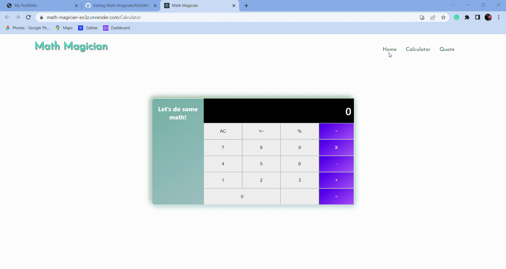

<a name="readme-top"></a>

<div align="center">
 <b> <i> <u> PREVIEW </u> </i></b> </br> </br>
 
</div>

<div align="center">
  <h3><b>Math Magician</b></h3>
</div>

# 📗 Table of Contents

- [📖 About the Project](#about-project)
  - [🛠 Built With](#built-with)
    - [Tech Stack](#tech-stack)
    - [Key Features](#key-features)
  - [🚀 Live Demo](#live-demo)
- [💻 Getting Started](#getting-started)
  - [Prerequisites](#prerequisites)
  - [Setup](#setup)
  - [Install](#install)
  - [Usage](#usage)
  - [Run tests](#run-tests)
- [👥 Authors](#authors)
- - [🔭 Future Features](#future-features)
- [🤝 Contributing](#contributing)
- [⭐️ Show your support](#support)
- [🙏 Acknowledgements](#acknowledgements)
- [❓ FAQ](#faq)
- [📝 License](#license)


# 📖 Math-Magicians <a name="about-project"></a>

**Math-Magicians** is a website for all fans of mathematics. It is a Single Page App (SPA) that allows users to:  make simple calculations and read a random math-related quote.

## 🛠 Built With <a name="built-with"></a>

### Tech Stack <a name="tech-stack"></a>

<details>
  <summary>Client</summary>
  <ul>
    <li><a href="https://reactjs.org/">React.js</a></li>
    <li><a href="https://redux.js.org/">Redux and Redux Toolkit</a></li>
    <li><a href="https://fonts.google.com/icons">Google Icons</a></li>
  </ul>
</details>

### Key Features <a name="key-features"></a>

- *Single Page App.**
- **Basic Calculations**
- **Pixel Perfect Design**

<p align="right">(<a href="#readme-top">back to top</a>)</p>

## 🚀 Live Demo <a name="live-demo"></a>

- [Experince a live demo](https://math-magician-eo3z.onrender.com/).

## 💻 Getting Started <a name="getting-started"></a>
To get a local copy up and running, follow these steps.

### Prerequisites

In order to run this project you need:

- A web browser to view output e.g [Google Chrome](https://www.google.com/chrome/).
- An IDE e.g [Visual studio code](https://code.visualstudio.com/).
- `node` should be installed in your local machine, [node website](https://nodejs.org/en/download/).
- Install the `npm` package manager use this [to install both node and npm](https://docs.npmjs.com/downloading-and-installing-node-js-and-npm).
- [A terminal](https://code.visualstudio.com/docs/terminal/basics).

### Setup

Clone this repository to your desired folder:

```
  git clone https://github.com/AdnanOlarmmi/Math-Magicains.git
```

- Navigate to the location of the folder in your machine:

you@your-Pc-name:~$ cd Math-Magicians

### Install

To install all dependencies, run:

```
  npm install
```

### Usage

After Cloning this repo to your local machine.
To get it running on your default browser and local host, run:

```
  npm start
```

### Run tests

To run tests, run:

```
  npm test
```

### Deployment

You can deploy this project using, Netlify:

- I used Render to delpoy the project.
- For more information, check [Render](https://render.com/) website.

<p align="right">(<a href="#readme-top">back to top</a>)</p>

<!-- AUTHORS -->

## 👥 Author <a name="authors"></a>

👤 **A.I.M. Shihab Uddin Khan** 

- GitHub: [@shihabrafio](https://github.com/shihabrafio)
- Twitter: [@shihab_uddin19](https://twitter.com/shihab_uddin19)
- LinkedIn: [Shihab Uddin Khan](https://www.linkedin.com/in/shihab-uddin-khan-45620a16a/)

<!-- FUTURE FEATURES -->

## 🔭 Future Features <a name="future-features"></a>

Future changes:
- Add animations and transitions
- Add more styles and colors

<p align="right">(<a href="#readme-top">back to top</a>)</p>

<!-- CONTRIBUTING -->

## 🤝 Contributing <a name="contributing"></a>

Contributions, issues, and feature requests are welcome!

Feel free to check the [issues page](../../issues/).

<p align="right">(<a href="#readme-top">back to top</a>)</p>

<!-- SUPPORT -->

## ⭐️ Show your support <a name="support"></a>


Give a ⭐️ if you like this project!

<p align="right">(<a href="#readme-top">back to top</a>)</p>

<!-- ACKNOWLEDGEMENTS -->

## 🙏 Acknowledgments <a name="acknowledgements"></a>

- Thanks to all Microverse community

<p align="right">(<a href="#readme-top">back to top</a>)</p>

<!-- LICENSE -->

## 📝 License <a name="license"></a>

This project is [MIT](./LICENSE) licensed.

<p align="right">(<a href="#readme-top">back to top</a>)</p>
